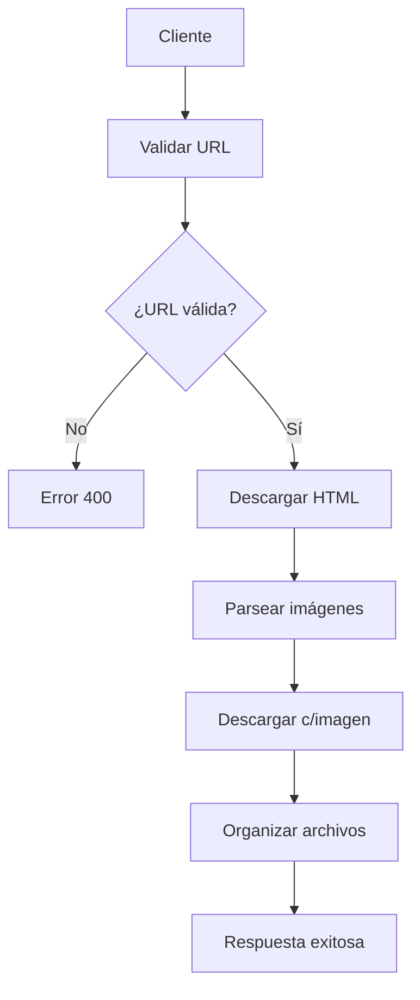

# 🖼️ Image Downloader API

[](https://spring.io/projects/spring-boot)
[](https://www.oracle.com/java/)
[](https://maven.apache.org/)
[](https://swagger.io/)
[](https://opensource.org/licenses/MIT)

Una API REST robusta y fácil de usar para descargar imágenes de sitios web de manera automática. Construida con Spring Boot, incluye documentación interactiva con Swagger UI y manejo inteligente de URLs.

## 🚀 Características Principales

- ✅ **Descarga masiva de imágenes** desde cualquier sitio web
- ✅ **Validación automática** de URLs antes de procesar
- ✅ **Organización inteligente** de archivos por dominio
- ✅ **Documentación interactiva** con Swagger UI
- ✅ **Manejo de URLs relativas** y absolutas
- ✅ **Control de errores robusto** con logging detallado
- ✅ **Arquitectura escalable** siguiendo mejores prácticas
- ✅ **User-Agent personalizable** para evitar bloqueos

## 📋 Tabla de Contenidos

- [Instalación](#-instalación)
- [Configuración](#-configuración)
- [Uso](#-uso)
- [Endpoints](#-endpoints)
- [Ejemplos](#-ejemplos)
- [Arquitectura](#-arquitectura)
- [Desarrollo](#-desarrollo)
- [Contribución](#-contribución)
- [Licencia](#-licencia)

## 🛠 Instalación

### Prerrequisitos

- ☕ **Java 17** o superior
- 📦 **Maven 3.6+**
- 🔧 **IntelliJ IDEA** (recomendado) o cualquier IDE Java

### Pasos de Instalación

1. **Clonar el repositorio**
```bash
git clone https://github.com/tu-usuario/image-downloader.git
cd image-downloader
```

2. **Compilar el proyecto**
```bash
mvn clean install
```

3. **Ejecutar la aplicación**
```bash
mvn spring-boot:run
```

4. **Verificar instalación**
- Aplicación: http://localhost:8080
- Swagger UI: http://localhost:8080/swagger-ui.html

## ⚙️ Configuración

### application.properties

```properties
# Servidor
server.port=8080
spring.application.name=image-downloader

# Swagger
springdoc.swagger-ui.path=/swagger-ui.html
springdoc.swagger-ui.enabled=true
springdoc.swagger-ui.tryItOutEnabled=true

# Archivos
spring.servlet.multipart.max-file-size=50MB
spring.servlet.multipart.max-request-size=50MB

# Logging
logging.level.com.example.imagedownloader=INFO
```

### Personalización

- **📁 Directorio de descarga**: Modifica la ruta en `downloadImagesFromUrl()`
- **⏱️ Timeout de conexión**: Ajusta en `urlExists()` método
- **🔍 User-Agent**: Personaliza en `downloadSingleImage()`

## 🎯 Uso

### Inicio Rápido

1. **Ejecutar la aplicación**
```bash
mvn spring-boot:run
```

2. **Abrir Swagger UI**
```
http://localhost:8080/swagger-ui.html
```

3. **Probar endpoint de validación**
```
GET /api/images/validate?url=https://unsplash.com
```

4. **Descargar imágenes**
```json
POST /api/images/download
{
    "url": "https://unsplash.com"
}
```

## 🔌 Endpoints

### 📊 Resumen de APIs

| Método | Endpoint | Descripción |
|--------|----------|-------------|
| `GET` | `/api/images/validate` | Validar una URL |
| `POST` | `/api/images/download` | Descargar imágenes de una URL |

### 🔍 Validar URL

**Endpoint:** `GET /api/images/validate`

**Parámetros:**
- `url` (string, requerido): URL a validar

**Respuesta:**
```json
{
    "isValid": true,
    "exists": true,
    "message": "La URL es válida y existe"
}
```

### ⬇️ Descargar Imágenes

**Endpoint:** `POST /api/images/download`

**Body:**
```json
{
    "url": "https://example.com"
}
```

**Respuesta:**
```json
{
    "success": true,
    "message": "Imágenes descargadas exitosamente",
    "folderPath": "C:\\images\\example.com\\uuid-123",
    "downloadedImages": [
        "image1.jpg",
        "logo.png",
        "banner.webp"
    ]
}
```

## 💡 Ejemplos

### Validar URL con cURL

```bash
curl -X GET "http://localhost:8080/api/images/validate?url=https://unsplash.com"
```

### Descargar imágenes con cURL

```bash
curl -X POST "http://localhost:8080/api/images/download" \
  -H "Content-Type: application/json" \
  -d '{"url": "https://unsplash.com"}'
```

### Usar desde JavaScript

```javascript
// Validar URL
const validateResponse = await fetch(
  'http://localhost:8080/api/images/validate?url=https://example.com'
);
const validation = await validateResponse.json();

// Descargar imágenes
const downloadResponse = await fetch(
  'http://localhost:8080/api/images/download',
  {
    method: 'POST',
    headers: { 'Content-Type': 'application/json' },
    body: JSON.stringify({ url: 'https://example.com' })
  }
);
const result = await downloadResponse.json();
```

## 🏗️ Arquitectura

### Estructura del Proyecto

```
src/main/java/com/example/imagedownloader/
├── 📄 ImageDownloaderApplication.java    # Aplicación principal
├── 📁 config/
│   └── 📄 SwaggerConfig.java             # Configuración OpenAPI
├── 📁 controller/
│   └── 📄 ImageDownloaderController.java # Endpoints REST
└── 📁 dto/
    ├── 📄 DownloadRequest.java           # Request DTO
    ├── 📄 DownloadResponse.java          # Response DTO
    └── 📄 ValidationResponse.java        # Validation DTO
```

### Tecnologías Utilizadas

- **🌟 Spring Boot 3.2.0**: Framework principal
- **🕷️ JSoup 1.17.2**: Parsing de HTML
- **📚 SpringDoc OpenAPI**: Documentación automática
- **☕ Java 17**: Lenguaje de programación
- **📦 Maven**: Gestión de dependencias

### Flujo de Trabajo



## 🔧 Desarrollo

### Ejecutar en modo desarrollo

```bash
mvn spring-boot:run -Dspring-boot.run.profiles=dev
```

### Ejecutar tests

```bash
mvn test
```

### Generar JAR ejecutable

```bash
mvn clean package
java -jar target/image-downloader-0.0.1-SNAPSHOT.jar
```

### Variables de Entorno

```bash
# Puerto personalizado
export SERVER_PORT=9090

# Nivel de logging
export LOGGING_LEVEL_ROOT=DEBUG

# Directorio de descarga
export DOWNLOAD_PATH=/custom/path/images
```

## 📝 Logging

La aplicación genera logs detallados:

```
2024-01-15 10:30:15 INFO  - Iniciando descarga de imágenes para: https://example.com
2024-01-15 10:30:16 INFO  - Encontradas 15 imágenes en la página
2024-01-15 10:30:17 INFO  - Imagen descargada: /images/example.com/uuid/image1.jpg
2024-01-15 10:30:18 ERROR - Error descargando imagen: timeout after 5000ms
2024-01-15 10:30:20 INFO  - Proceso completado: 14/15 imágenes descargadas
```

## ⚠️ Consideraciones Importantes

### Límites y Restricciones

- **🕐 Timeout**: 5 segundos por conexión
- **📏 Tamaño máximo**: 50MB por archivo
- **🚫 Robots.txt**: Respeta las restricciones del sitio
- **🔒 Autenticación**: No soporta sitios con login

### Buenas Prácticas

- ✅ Validar URLs antes de descargar
- ✅ Verificar espacio en disco disponible
- ✅ Respetar términos de uso de sitios web
- ✅ Implementar rate limiting para uso intensivo

## 🐛 Solución de Problemas

### Errores Comunes

**❌ "URL no válida"**
```
Solución: Verificar que la URL incluya http:// o https://
```

**❌ "Connection timeout"**
```
Solución: Verificar conectividad a internet o aumentar timeout
```

**❌ "Permission denied al crear carpeta"**
```
Solución: Verificar permisos de escritura en C:\images\
```

**❌ "No se encontraron imágenes"**
```
Solución: La página puede usar JavaScript para cargar imágenes
```

## 🚀 Próximas Funcionalidades

- [ ] 🔄 Descarga en lotes (múltiples URLs)
- [ ] 🎛️ Filtros por tipo/tamaño de imagen
- [ ] 📊 Dashboard web con estadísticas
- [ ] 🔐 Autenticación JWT
- [ ] 📱 API móvil optimizada
- [ ] 🗄️ Base de datos para historial
- [ ] 🔔 Notificaciones por email/webhook

## 🤝 Contribución

¡Las contribuciones son bienvenidas! Por favor:

1. 🍴 Fork el proyecto
2. 🌿 Crea una rama feature (`git checkout -b feature/NuevaFuncionalidad`)
3. 💾 Commit tus cambios (`git commit -m 'Agrega nueva funcionalidad'`)
4. 📤 Push a la rama (`git push origin feature/NuevaFuncionalidad`)
5. 🔄 Abre un Pull Request

### Estándares de Código

- ✅ Seguir convenciones de Java
- ✅ Documentar métodos públicos
- ✅ Incluir tests unitarios
- ✅ Actualizar documentación

## 📄 Licencia

Este proyecto está bajo la Licencia MIT. Ver archivo [LICENSE](LICENSE) para más detalles.

```
MIT License

Copyright (c) 2024 Image Downloader Contributors

Permission is hereby granted, free of charge, to any person obtaining a copy
of this software and associated documentation files (the "Software"), to deal
in the Software without restriction, including without limitation the rights
to use, copy, modify, merge, publish, distribute, sublicense, and/or sell
copies of the Software, and to permit persons to whom the Software is
furnished to do so, subject to the following conditions:

The above copyright notice and this permission notice shall be included in all
copies or substantial portions of the Software.
```

## 👥 Autores

- **Tu Nombre** - *Desarrollo inicial* - [@tu-usuario](https://github.com/tu-usuario)

## 🙏 Agradecimientos

- Spring Boot community por el excelente framework
- JSoup desarrolladores por la librería de parsing HTML
- Swagger/OpenAPI por las herramientas de documentación
- Todos los contribuidores del proyecto

## 📞 Soporte

¿Necesitas ayuda? 

- 📧 **Email**: soporte@imagedownloader.com
- 🐛 **Issues**: [GitHub Issues](https://github.com/tu-usuario/image-downloader/issues)
- 📚 **Documentación**: [Wiki del Proyecto](https://github.com/tu-usuario/image-downloader/wiki)
- 💬 **Discussions**: [GitHub Discussions](https://github.com/tu-usuario/image-downloader/discussions)

---

⭐ **¡Si este proyecto te resultó útil, no olvides darle una estrella!** ⭐